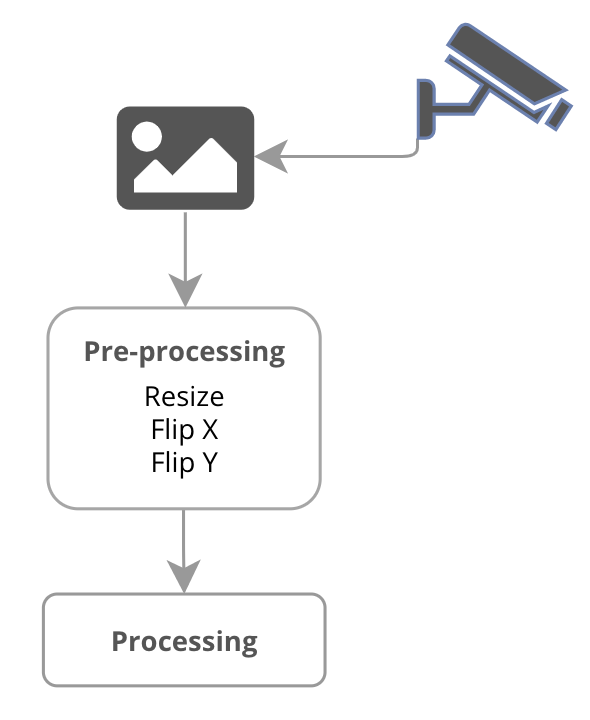

# Overview

## Introducción
El presente módulo se encarga de gestionar la lectura de imágenes provenientes de una o múltiples cámaras,  de hilos (threads). Para ello emplea el API de python-opencv.

## Cámara simple
Cada dispositivo de imagen es gestionado por una instancia de la clase `Camera`, cuya documentación y parámetros se puede consultar [aquí](/remio/camera/single).
```python
"""Single simple camera example."""
import time
from remio import Camera

# Initialize Single Camera device
camera = Camera(name="webcam", src=0, size=[400, 400])
camera.start()


while True:
    print("Doing some tasks...")
    time.sleep(2)

```

## Lectura
Para la lectura de imágenes, el API es similar a opencv, con la diferencia de que si ocurre algún error en la lectura, la función `read()` retornará un tipo vacío (None).

```python

image = camera.read()
if image is not None:
  display(image)
```


## Multiples Cámaras
Para la gestión de múltiples cámaras, se puede emplear la clase `Cameras`, cuyo API es, similar a un dicionario, o a un JSON, con diversas instancias de la clase `Camera` permite configurar el uso de múltiples dispositivos.
```python

"""Multiple cameras manage."""
import time
import cv2
from remio import Cameras


# Define devices
devices = {
    "webcam1": {
        "src": 0,
        "size": [400, 300],
        "fps": None,
        "reconnectDelay": 5,
        "backgroundIsEnabled": True,
        "emitterIsEnabled": False,
    },
    "webcam2": {
        "src": "http://192.168.100.70:3000/video/mjpeg",
        "size": [400, 300],
        "fps": None,
        "reconnectDelay": 5,
        "backgroundIsEnabled": True,
        "emitterIsEnabled": False,
    },
}

# Intialize Serial manager
camera = Cameras(devices=devices)

# Start device(s) connection on background
camera.startAll()

# Set a FPS speed to display image(s)
FPS = 20
T = 1 / FPS

while True:

    t0 = time.time()

    webcam1, webcam2 = camera.read(asDict=False)
    camera.clearAllFrames()  # to avoid repeated frames

    if webcam1 is not None:
        cv2.imshow("webcam1", webcam1)

    if webcam2 is not None:
        cv2.imshow("webcam2", webcam2)

    if cv2.waitKey(1) & 0xFF == ord("q"):
        break

    t1 = time.time()

    # Get a fixed delay value (t1 - t0) + delay = T
    delay = abs(T - (t1 - t0))
    time.sleep(delay)


# Close all Windows
cv2.destroyAllWindows()

# Stop all Running devices
camera.stopAll()


```


## Processing
Para facilitar el uso de funciones de procesamiento, el módulo de `Camera` y el de `Cameras` permiten agregar rutinas a sus respectivos hilo de ejecución.

<figure markdown>
  { width="300" }
  <figcaption><b>Figura</b> Flujo de lectura</figcaption>
</figure>

```python

"""Processing function API."""
import time
import cv2
from remio import Cameras


def processing(frame, *args, **kwargs):
    """Do some image processing.

    Args:
        frame: a numpy array
    """
    frame = cv2.cvtColor(frame, cv2.COLOR_BGR2GRAY)
    return frame


# Intialize Camera manager
camera = Cameras(devices={"webcam": {"src": 0, "size": [400, 300]}})
camera["webcam"].setProcessing(processing)

# Start device(s) read loops on background
camera.startAll()

# Set a FPS speed to display image(s)
FPS = 30
T = 1 / FPS

while True:

    t0 = time.time()

    frame = camera["webcam"].read()
    camera.clearAllFrames()  # to avoid repeated frames

    if frame is not None:
        cv2.imshow("webcam1", frame)

    if cv2.waitKey(1) & 0xFF == ord("q"):
        break

    t1 = time.time()

    # Get a fixed delay value (t1 - t0) + delay = T
    delay = abs(T - (t1 - t0))
    time.sleep(delay)


# Close all Windows
cv2.destroyAllWindows()

# Stop all Running devices
camera.stopAll()


```