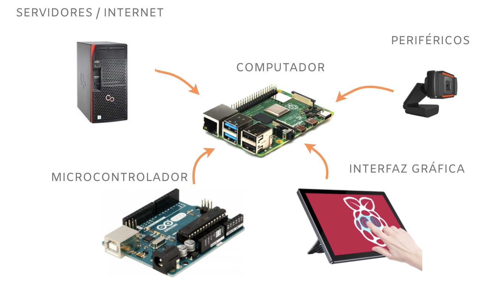
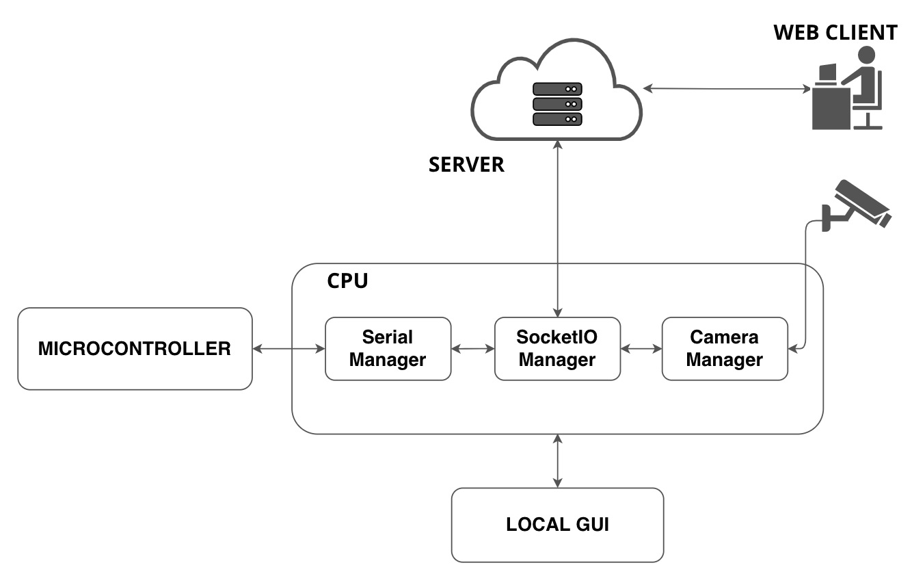

<div align="center"> <h1>RemIO</h1> </div>
## Introducción

<div style="text-align: justify">
<b>RemIO</b> es un módulo de python destinado al desarrollo de dispositivos IoT, basados en comunicación <i>serial</i>, comunicación socketIO y procesamiento de imágenes, que permite integrar hardware y software vario, con <u>interfaces gráficas</u>, <u>control remoto</u> y <u>transmisión de video</u>, empleando para ello, librerías tan comunes como:
</div>

<ul>
<li>OpenCV</li>
<li>PySerial</li>
<li>SocketIO</li>
</ul>

## Arquitectura

<div style="text-align: justify">
En el presente contexto, este software pretende agilizar la producción de dispositvos electrónicos cuya arquitectura sea afin a la siguiente propuesta:
</div>
<br>

<div align="center"><b>Figura.</b> Arquitectura propuesta para el uso de la librería.</div>
<br>
<div style="text-align: justify">
<b>`COMPUTADOR`</b>: Se encarga de manejar la complejidad que pueda acarrear un cierto proyecto, como pueden ser sus algoritmos de procesamiento, o la comunicación con servidores en internet.
<br>
<br>
<b>`MICROCONTROLADOR`</b>: Interactúa con dipositivos de control, como pueden ser actuadores.
<br>
<br>
<b>`INTERFAZ GRÁFICA`</b>: Es un apartado visual que se puede desarrollar con varios frameworks como son PyQt5, Tkinter, Kivy.
<br>
<br>
<b>`PERIFÉRICOS`</b>: Son diversos dispositivos que se pueden conectar directamente al computador.
<br>
<br>
<b>`SERVIDORES`</b>: Para el manejo de comunicación entre diferentes clientes.
<hr>
</div>

<div style="text-align: justify">
Esta distribución de componentes es práctica para el desarrollo de prototipos que demandan cierta complejidad de procesamiento, como puede ser el caso de un <b>robot</b>, un algoritmo de <b>IA</b> y cualquier otra posibilidad que este al alcance de esta combinación.
</div>

## Módulos
Para la gestión de los diversos procesos y el manejo de eventos, REMIO implementa el siguiente esquema:

<div align="center"><b>Figura.</b> Módulos.</div>

<br>

<b>`SERIAL MANAGER`</b>: Se encarga de gestionar los diversos eventos que acontecen en los puertos seriales. Maneja callbacks de conexión y <b>lectura</b>, y también permite la <b>escritura</b> de datos. Su documentación y uso se pueden encontrar [AQUÍ](/remio/serial/overview).
<br>

<b>`SOCKETIO MANAGER`</b>: Se encarga de gestionar comunicaciones en tiempo real por medio del protocolo <b>SocketIO</b>. Su documentación y uso se pueden encontrar [AQUÍ](/remio/socketio/overview).
<br>

<b>`CAMERA MANAGER`</b>: Se encarga de gestionar video e imágenes provenientes de cámaras, emplenado para ello el API de OpenCV. Su documentació y uso se pueden encontrar [AQUÍ](/remio/camera/overview).
<br>


## Características

Las principales características de REMIO son:

<ul>
<li>Manejo de múltiples cámaras a través de hilos.</li>
<li>Uso de callbacks y eventos.</li>
<li>API para incluir funciones de procesamiento de video.</li>
<li>Manejo de múltiples dispositivos seriales a través de hilos.</li>
<li>Manejo síncrono y asíncrono de SocketIO.</li>
<li>Transmisión de video MJPEG a través de SocketIO.</li>

</ul>

## Instalación

Cree un entorno virutal:
```sh
python3 -m venv venv

source venv/bin/activate
```
Use pip:
```sh
pip install remio
```
O clone el repositorio:
```
git clone https://github.com/Hikki12/remio

cd remio

pip install .
```

## Primeros Pasos
Realizada la instalación del presente módulo, te sugerimos revisar alguno de los siguientes apartados:
<ul>
<li><a href="/remio/camera/overview/">Camera</a></li>
<li><a href="/remio/serial/overview/">Serial</a></li>
<li><a href="/remio/socketio/overview/">SocketIO</a></li>
<li><a href="/remio/mockup/overview/">Mockup</a></li>
</ul>
<br>
<br>